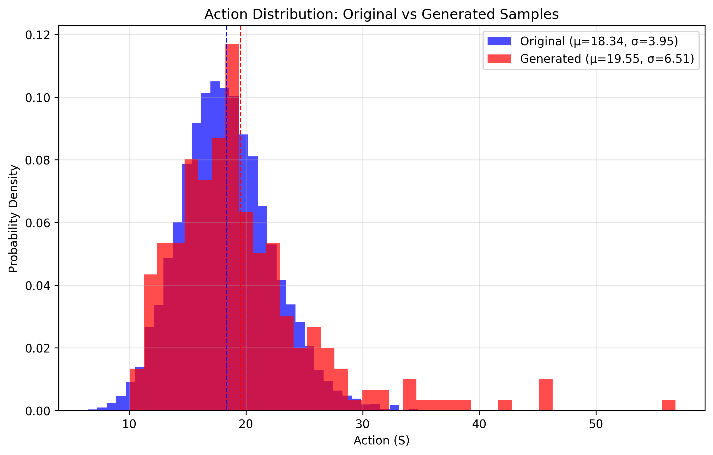

# Lattice Field Theory Diffusion Model

A diffusion model for generating lattice field configurations in 1D scalar field theory. This project uses denoising diffusion probabilistic models to learn and generate quantum field configurations that match the statistical properties of configurations generated through Monte Carlo simulations. The diffusion model uses a 1D U-Net architecture, implemented with [denoising-diffusion-pytorch](https://github.com/lucidrains/denoising-diffusion-pytorch).

## Physics Background

This project implements a 1+1D scalar field theory on a lattice with Euclidean action:

$$S[\phi] = \sum_{n=0}^{N-1} \left[ \frac{1}{2}(\phi_{n+1} - \phi_n)^2 + \frac{m^2}{2}\phi_n^2 + \frac{g^2}{4}\phi_n^4 \right]$$

Where:
- $\phi_n$ are the field values at lattice sites
- $m^2$ is the mass term (can be negative for symmetry breaking)
- $g^2$ is the quartic coupling constant
- Periodic boundary conditions are applied

The diffusion model learns to generate field configurations that sample from the Boltzmann distribution $P[\phi] \propto e^{-S[\phi]}$.

For an analytical treatment of the 0+1D model, as well as a discussion of autocorrelation times, see [A Metropolitan Adventure](A_Metropolitan_Adventure.pdf).

### Validation and Analysis

The model's performance can be evaluated by comparing the action distributions of generated samples with the original training data. The following shows the result after a moderate amount of training:

*Figure: Comparison of action distributions between original Monte Carlo samples and diffusion model generated samples, showing the model successfully learns the underlying field theory statistics.*

